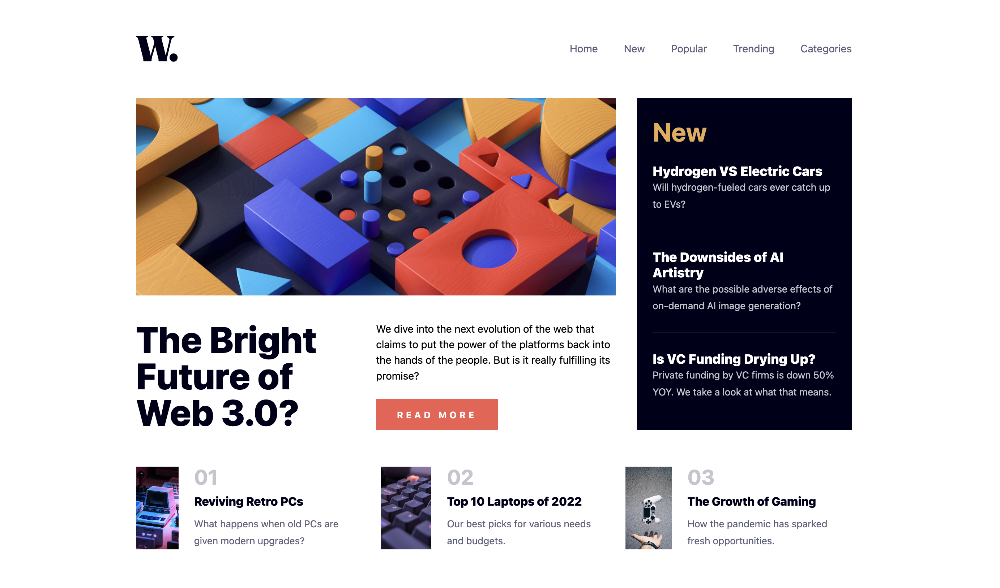

# 🪄 🗞️ News Stand

A news/blog UI built with Vite, React & Tailwind CSS.

 

## 🥡 Learning takeaways
- Flexbox
- Animation (coming)
- Responsive design: discover container & style queries (coming)
- SVG styling & animating (coming)

 

## 🍩 Coming up next
- Article page
- Routing with article ID in URL
- Data option #1: Fetching a news API (to be found)
- Data option #2: Adding a CMS (Github, Sanity, Scrapi, other)
- Tests

 

 

*Credit: [UI by Frontend Mentor](https://www.frontendmentor.io/challenges/news-homepage-H6SWTa1MFl).*
